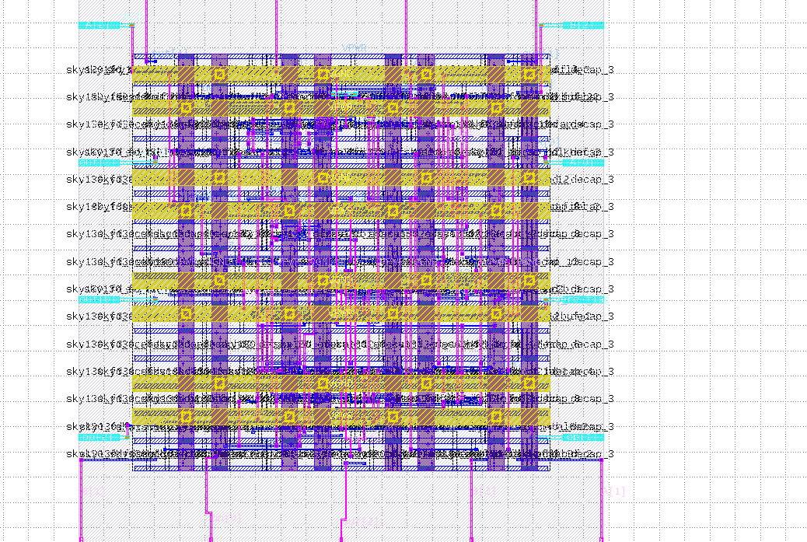

# 4-bit ALU — RTL to GDSII (Sky130 130nm)

This project takes a 4-bit ALU written in Verilog through the complete OpenLane RTL-to-GDSII flow using the SkyWater Sky130 130nm open-source PDK. The design implements arithmetic (addition, subtraction), bitwise logic (AND, OR, XOR, NOT), and a zero-flag output. The final GDSII passes all sign-off checks with zero violations.

## Flow

```
Verilog RTL → Synthesis (Yosys) → Floorplanning → Placement → CTS → Routing (OpenROAD) → GDSII Streamout (Magic + KLayout) → Sign-off
```

## Verification Results

| Check           | Result                                        |
|-----------------|-----------------------------------------------|
| DRC             | 0 violations (Magic + KLayout)               |
| LVS             | 0 errors (exact net/device/pin/property match)|
| XOR             | 0 differences (Magic GDS vs KLayout GDS)     |
| Antenna         | 0 pin violations, 0 net violations           |
| Setup Timing    | WNS = 0.00 ns, worst slack = 2.92 ns         |
| Hold Timing     | WNS = 0.00 ns, worst slack = 4.26 ns         |

## Debugging Notes

During Global Placement, the flow failed with **GPL-0302** (target density too high for the small core area). The fix was to reduce `FP_CORE_UTIL` from 50 to 30 and `PL_TARGET_DENSITY` from 0.6 to 0.45 in `config.tcl`. After this adjustment, placement completed successfully.

## Tools Used

- **OpenLane** v1.0.2
- **Yosys** — Logic synthesis
- **OpenROAD** — Floorplanning, placement, CTS, routing
- **Magic** — DRC, GDSII streamout
- **KLayout** — GDSII streamout, XOR comparison
- **Netgen** — LVS
- **Sky130A PDK** (sky130_fd_sc_hd standard cell library)

## Die Specs

| Parameter       | Value                  |
|-----------------|------------------------|
| Core Area       | 40.94 × 40.8 µm       |
| Standard Cells  | sky130_fd_sc_hd       |
| Clock Period    | 10 ns                  |

## Chip Layout


