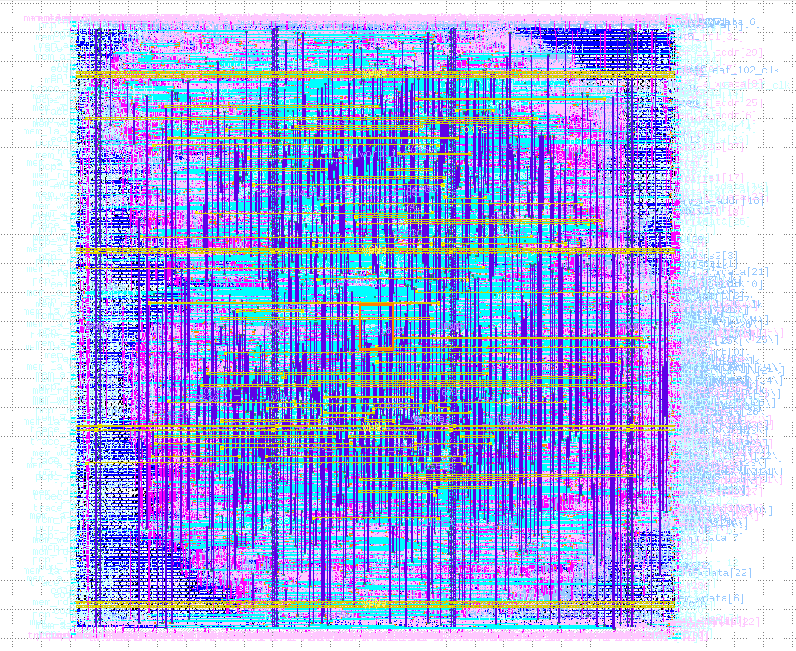

# PicoRV32 RISC-V Core -- RTL to GDSII (Sky130 130nm)

PicoRV32 is an open-source RV32I RISC-V CPU core by Claire Wolf / YosysHQ taken through the complete physical design flow using OpenLane on the SkyWater Sky130 130nm open-source PDK. This is a real CPU core, significantly larger than a simple ALU, demonstrating that open-source tools can handle processor-scale designs through to a clean GDSII layout.

## Flow

Verilog RTL -> Synthesis (Yosys) -> Floorplanning -> Placement -> CTS -> Routing (OpenROAD) -> GDSII Streamout (Magic + KLayout) -> Sign-off

## Verification Results

| Check        | Result                                        |
|--------------|-----------------------------------------------|
| DRC          | 0 violations (Magic + KLayout)               |
| LVS          | 0 errors (exact net/device/pin/property match)|
| XOR          | 0 differences (Magic GDS vs KLayout GDS)     |
| Antenna      | 0 actual violations (highest ratio 5.02 vs 400.0 threshold) |
| Setup Timing | TNS = 0.00 ns, WNS = 0.00 ns, worst slack = +9.96 ns |
| Hold Timing  | TNS = 0.00 ns, WNS = 0.00 ns, worst slack = +0.33 ns |

## Engineering Notes

The clock period was set to **20 ns** (relaxed from the typical 10 ns default) as a deliberate speed-vs-timing tradeoff. This conservative choice ensured clean timing closure on a CPU-scale design on the first pass, resulting in significant positive margin (+9.96 ns setup, +0.33 ns hold). Future iterations can tighten the period to push higher frequency.

## Tools Used

- **OpenLane** v1.0.2
- **Yosys** -- Logic synthesis
- **OpenROAD** -- Floorplanning, placement, CTS, routing
- **Magic** -- DRC, GDSII streamout
- **KLayout** -- GDSII streamout, XOR comparison
- **Netgen** -- LVS
- **Sky130A PDK** (sky130_fd_sc_hd standard cell library)

## Chip Layout

